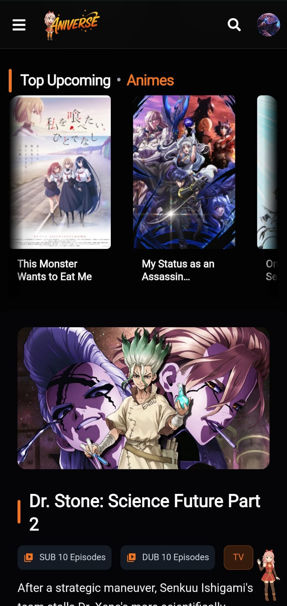
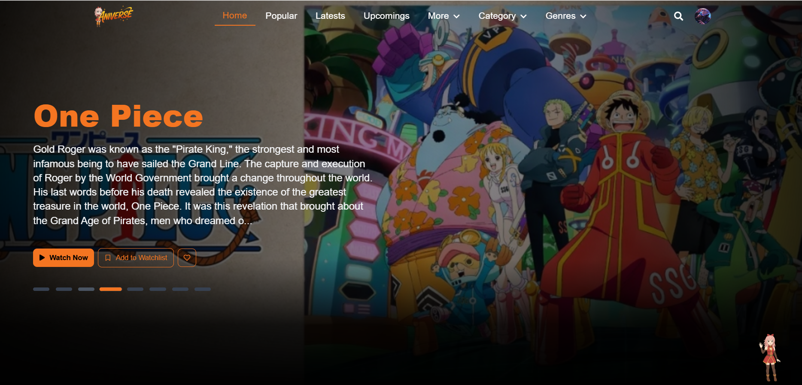
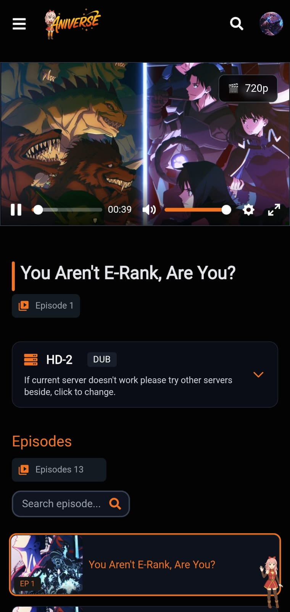
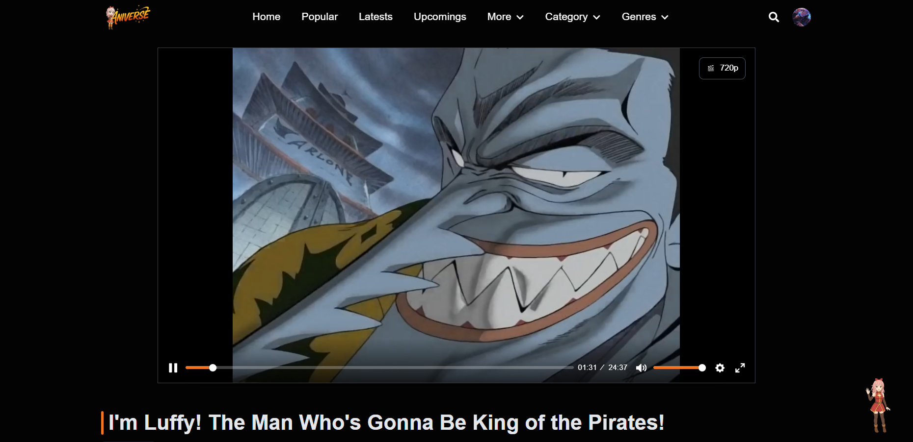
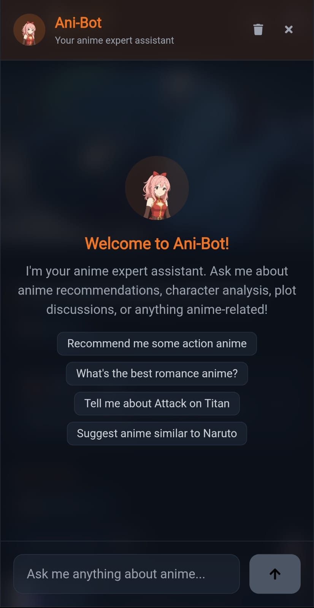
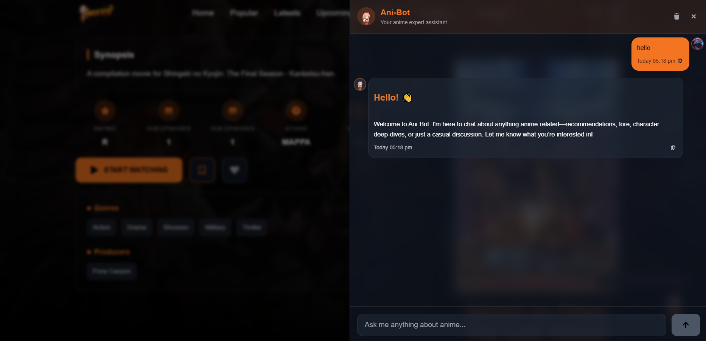
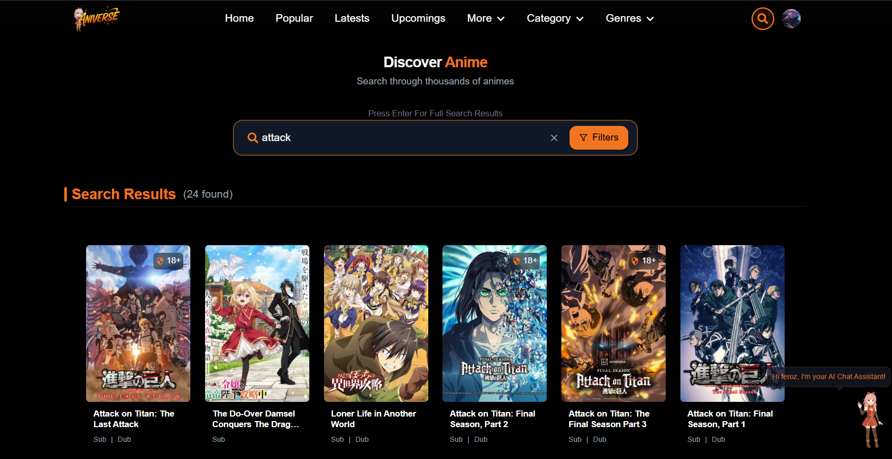
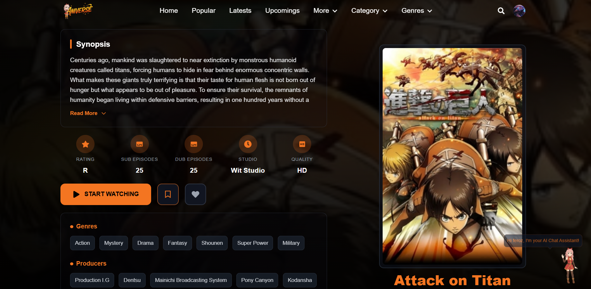

<div align="center">


# Anime Streaming Platform

### A modern, full-stack anime streaming web application built with React and Node.js

[](https://anime-frontend-nu.vercel.app)
[](https://reactjs.org/)
[](https://nodejs.org/)
[](https://mongodb.com/)

*Featuring advanced video streaming, AI-powered chat, user authentication, and comprehensive anime database integration*

</div>

---  

## 🎮 Demo
<div>&nbsp;&nbsp;&nbsp;&nbsp;</div> 
Live Demo : https://anime-frontend-nu.vercel.app
 <div>&nbsp;&nbsp;&nbsp;&nbsp;</div> 
 
---

## ✨ Features & Highlights

### 🎥 **Video Streaming**
- **HLS Video Player**: Advanced video streaming with HLS.js and Plyr
- **Multiple Servers**: Support for multiple streaming servers (Sub/Dub)
- **Quality Selection**: Dynamic quality switching (1080p, 720p, 480p, 360p, Auto)
- **CORS Proxy**: Built-in proxy system to bypass CORS restrictions
- **Episode Caching**: MongoDB-based caching for improved performance
- **Subtitle Support**: Integrated subtitle/caption functionality

### 🤖 **AI-Powered Features**
- **AI Chat Assistant**: Groq-powered AI chat for anime recommendations and queries
- **Chat History**: Persistent conversation history with MongoDB storage
- **Smart Recommendations**: AI-driven anime suggestions based on user preferences

### 👤 **User Management**
- **Authentication System**: JWT-based secure login/registration
- **User Profiles**: Personalized user profiles with avatar support
- **Watch History**: Track and resume watching episodes
- **Favorites & Watchlist**: Save favorite anime and create watchlists
- **Progress Tracking**: Automatic episode progress tracking

### 🎨 **Modern UI/UX**
- **Responsive Design**: Mobile-first design with Tailwind CSS
- **Smooth Animations**: Framer Motion animations throughout the app
- **Dark Theme**: Crunchyroll-inspired dark theme design
- **Interactive Components**: Hover effects, loading states, and transitions
- **Toast Notifications**: Real-time user feedback system

### 🔍 **Search & Discovery**
- **Advanced Search**: Real-time search with suggestions
- **Category Browsing**: Browse by genres, categories, and producers
- **Trending & Popular**: Discover trending and popular anime
- **Seasonal Anime**: Browse current and upcoming seasonal releases
- **Filter System**: Advanced filtering options for better discovery

---

## 📸 Screenshots

<div align="center">

### Homepage
<p align="center">
  <table>
    <tr>
      <td valign="top">
        
      </td>  
    <td>&nbsp;&nbsp;&nbsp;&nbsp;</td>
      <td valign="center">
        
      </td>
    </tr>
  </table>
</p>

### Video Player
<p align="center">
  <table>
    <tr>
      <td valign="top">
        
      </td>  
    <td>&nbsp;&nbsp;&nbsp;&nbsp;</td>
      <td valign="center">
        
      </td>
    </tr>
  </table>
</p>

###  AI Chat Assistant
<p align="center">
  <table>
    <tr>
      <td valign="top">
        
      </td>  
    <td>&nbsp;&nbsp;&nbsp;&nbsp;</td>
      <td valign="center">
        
      </td>
    </tr>
  </table>
</p>

###  More
<p align="center">
  <table>
    <tr>
      <td valign="top">
        
      </td>  
    <td>&nbsp;&nbsp;&nbsp;&nbsp;</td>
      <td valign="center">
        
      </td>
    </tr>
  </table>
</p>

</div>

## 🛠️ Technology Stack

### **Frontend**
- **React 19** - Modern React with latest features
- **Vite** - Fast build tool and development server
- **Redux Toolkit** - State management with RTK Query
- **React Router v7** - Client-side routing
- **Tailwind CSS** - Utility-first CSS framework
- **Framer Motion** - Animation library
- **HLS.js** - HTTP Live Streaming support
- **Plyr** - Modern HTML5 video player
- **Axios** - HTTP client for API requests

### **Backend**
- **Node.js** - JavaScript runtime
- **Express.js** - Web application framework
- **MongoDB** - NoSQL database with Mongoose ODM
- **JWT** - JSON Web Token authentication
- **Groq SDK** - AI chat integration
- **Bcrypt** - Password hashing
- **CORS** - Cross-origin resource sharing

### **External APIs**
- **AniList GraphQL API** - Anime metadata, search, rankings, genres, studios, and recommendations
- **HiAnime-compatible API** - Legacy streaming-server and source integration only
- **Groq AI** - AI chat functionality

## 📁 Project Architecture

```
Anime/
├── Frontend/                 # React frontend application
│   ├── src/
│   │   ├── components/      # Reusable UI components
│   │   │   ├── VideoPlayer.jsx    # Advanced video player
│   │   │   ├── AiChat.jsx         # AI chat interface
│   │   │   ├── Navbar.jsx         # Navigation component
│   │   │   ├── AnimeCards.jsx     # Anime card components
│   │   │   ├── EpisodeHistory.jsx # Watch history display
│   │   │   └── ...
│   │   ├── pages/           # Page components
│   │   │   ├── Home.jsx           # Homepage
│   │   │   ├── Episodes.jsx       # Episode player page
│   │   │   ├── Search.jsx         # Search functionality
│   │   │   ├── Profile.jsx        # User profile
│   │   │   └── ...
│   │   ├── redux/           # State management
│   │   │   ├── apifetch/          # API slice definitions
│   │   │   └── slices/            # Redux slices
│   │   └── assets/          # Static assets
│   ├── public/              # Public assets
│   └── package.json         # Frontend dependencies
├── Backend/                 # Node.js backend API
│   ├── controllers/         # Route controllers
│   │   ├── fetchDataController.js  # Anime data fetching
│   │   ├── authcontroller.js       # Authentication
│   │   ├── userAnimeController.js  # User anime data
│   │   └── aiChatController.js     # AI chat handling
│   ├── models/              # MongoDB schemas
│   │   ├── AnimeData.js           # Anime data model
│   │   ├── authModel.js           # User model
│   │   ├── StreamLink.js          # Stream links model
│   │   ├── EpisodeModel.js        # Episode model
│   │   └── ChatMessage.js         # Chat message model
│   ├── routes/              # API routes
│   ├── middlewares/         # Custom middleware
│   ├── configs/             # Configuration files
│   └── package.json         # Backend dependencies
└── README.md               # Project documentation
```

## 🚀 Quick Start Guide

### Prerequisites
- **Node.js** (v16 or higher)
- **MongoDB** (local or cloud instance)
- **npm** or **yarn**

### Installation

1. **Clone the repository**
   ```bash
   git clone <repository-url>
   cd Anime
   ```

2. **Install root dependencies**
   ```bash
   npm install
   ```

3. **Setup Backend**
   ```bash
   cd Backend
   npm install
   ```

4. **Setup Frontend**
   ```bash
   cd ../Frontend
   npm install
   ```

### Environment Configuration

Create a `.env` file in the `Backend` directory:

```env
# Database
MONGODB_URI=mongodb://localhost:27017/anime-streaming

# JWT
JWT_SECRET=your-super-secret-jwt-key

# External APIs
# Public metadata API (no API key required)
ANILIST_API_URL=https://graphql.anilist.co
ANILIST_CACHE_TTL_MS=300000

# Optional legacy streaming provider. AniList does not provide video sources.
BACKEND_URL=
SELF_URL=http://localhost:6789

# AI Chat (Groq)
GROQ_API_KEY=your-groq-api-key

# Server
PORT=6789
```

### Running the Application

1. **Start Backend Server**
   ```bash
   cd Backend
   npm run dev
   ```
   Backend will run on `http://localhost:6789`

2. **Start Frontend Development Server**
   ```bash
   cd Frontend
   npm run dev
   ```
   Frontend will run on `http://localhost:5173`

## 📋 API Documentation

### **Anime Data**
- `GET /api/anime/getdata` - Fetch homepage data
- `GET /api/anime/category/:name/:page` - Browse by category
- `GET /api/anime/genre/:name/:page` - Browse by genre
- `GET /api/anime/animedata/:id` - Get anime details
- `GET /api/anime/episodes/:id` - Get episode list
- `POST /api/anime/episodes-server` - Get streaming servers
- `POST /api/anime/episodes-stream-links` - Get stream links
- `GET /api/anime/proxy-stream` - Proxy video streams

### **Authentication**
- `POST /api/auth/register` - User registration
- `POST /api/auth/login` - User login
- `GET /api/auth/verify` - Verify JWT token

### **User Features**
- `POST /api/userAnime/add-to-history` - Add to watch history
- `GET /api/userAnime/get-history` - Get watch history
- `POST /api/userAnime/add-to-favorites` - Add to favorites
- `GET /api/userAnime/get-favorites` - Get favorites

### **AI Chat**
- `POST /api/ai/chat` - Send chat message
- `GET /api/ai/history/:userId` - Get chat history

## 🎯 Feature Deep Dive

### **Advanced Video Player**
- Built with HLS.js for adaptive streaming
- Plyr integration for modern controls
- Custom quality selector and subtitle support
- CORS proxy for seamless streaming
- Episode progress tracking and auto-resume

### **AI Chat System**
- Groq-powered AI assistant
- Context-aware anime recommendations
- Persistent chat history
- Real-time streaming responses

### **User Experience**
- Smooth page transitions with Framer Motion
- Responsive design for all devices
- Real-time search with debouncing
- Infinite scroll for large datasets
- Toast notifications for user feedback

### **Performance Optimizations**
- MongoDB caching for frequently accessed data
- Lazy loading for images and components
- Debounced search to reduce API calls
- Optimized Redux state management
- Code splitting and bundle optimization

## 🔧 Development Workflow

### **Frontend Development**
```bash
cd Frontend
npm run dev      # Start development server
npm run build    # Build for production
npm run preview  # Preview production build
npm run lint     # Run ESLint
```

### **Backend Development**
```bash
cd Backend
npm run dev      # Start with nodemon
npm start        # Start production server
```

## 🚀 Production Deployment

### **Frontend (Vercel)**
1. Build the frontend: `npm run build`
2. Deploy the `dist` folder to your hosting platform
3. Configure environment variables

### **Backend (Vercel)**
1. Set up environment variables
2. Deploy the Backend folder
3. Ensure MongoDB connection is configured

## 🤝 Contributing

1. Fork the repository
2. Create a feature branch: `git checkout -b feature/new-feature`
3. Commit changes: `git commit -am 'Add new feature'`
4. Push to branch: `git push origin feature/new-feature`
5. Submit a Pull Request


<!-- ## 🌟 Performance Metrics

<div align="center">


</div> -->

## 🎮 Demo Features


- 🎬 **Stream Episodes** - Watch your favorite anime with HLS streaming
- 🤖 **AI Chat** - Ask for anime recommendations 
- 🔍 **Search** - Find anime by name, genre, or category
- 📱 **Mobile Experience** - Fully responsive on all devices
- 🎯 **User Profiles** - Create account and track watch history

## 🙏 Credits & Acknowledgments

<div align="center">

**Special Thanks To:**

[](https://hianime.to)
[](https://groq.com)
[](https://crunchyroll.com)

</div>

---

<div align="center">

**⭐ If you found Like this project, please give it a star! ⭐**

<!-- Made with ❤️ for the anime community -->

</div>
